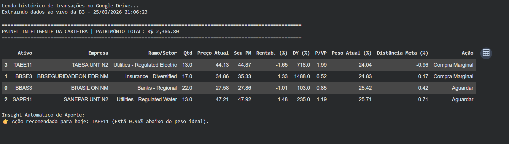

# 📈 Automação e Balanceamento de Carteira B3

Um pipeline de dados (ETL) e dashboard gerencial construído em Python para automatizar o acompanhamento, o rebalanceamento e a análise preditiva de uma carteira de ações na Bolsa de Valores Brasileira (B3).

## 🎯 O Problema

Plataformas de corretoras e planilhas manuais mostram a cotação atual, mas falham em fornecer *insights* acionáveis. O investidor frequentemente perde tempo calculando preço médio na mão, tem dificuldade de projetar recebimentos futuros ou deixa o emocional ditar qual ativo comprar no mês.

## 💡 A Solução

Este projeto utiliza conceitos de Engenharia de Dados, Business Intelligence e Análise Preditiva para criar uma arquitetura autônoma e inteligente:

1. **Extract:** Consome dados transacionais diretamente de um banco de dados em nuvem (Google Sheets) via API, mantendo o histórico de compras como fonte única da verdade.
2. **Transform:** Realiza o agrupamento matemático das posições, calcula o Preço Médio ponderado e cruza com dados em tempo real da B3.
3. **Load/BI & Analytics:** Gera análises profundas sobre a saúde da carteira, indo muito além do saldo atual.

### 🌟 Funcionalidades Principais (Features)

* **Smart Allocation (Rebalanceamento):** Calcula a distância exata de cada ativo em relação à meta de alocação da carteira, indicando matematicamente onde deve ser o aporte do mês para diluir riscos.
* **DRE e Performance Global:** Acompanhamento do resultado não-realizado (lucro/prejuízo) de forma consolidada, permitindo a visão clara do retorno sobre o capital investido.
* **Inteligência Preditiva (Viés de 30 Dias):** Modelagem que analisa a tendência de preço dos ativos para os próximos 30 dias, auxiliando no *timing* de compra (identificando possíveis correções ou altas).
* **Agenda de Dividendos (Fluxo de Caixa):** Mapeamento e estimativa dos próximos proventos a serem recebidos, organizados em uma linha do tempo para facilitar a previsibilidade de renda passiva.

## 📊 Visualização dos Dados (Dashboards)

Abaixo estão alguns exemplos das análises geradas pelo projeto:

**1. Smart Allocation (Indicação de Aporte do Mês)**
*Cálculo matemático que indica o ativo ideal para compra, visando manter o balanceamento e diluir o risco da carteira.*

**2. Performance Global e DRE da Carteira**

**3. Composição do patrimônio e Lucro / Prejuizo por Empresa**

**4. Estimativa de recebimentos e Viés de Movimento**

## 🛠️ Tecnologias Utilizadas

* **Python**
* **Pandas:** Para manipulação de DataFrames, limpeza e cálculos de agregação financeira.
* **YFinance:** Para extração de cotações, indicadores fundamentalistas (DY, P/VP) e histórico de preços em tempo real.
* **Gspread / Google Auth:** Para integração segura e consumo de dados via API.
* **Matplotlib / Seaborn / Plotly**: Para visualização de dados e plotagem da composição do patrimônio e tendências.

## 📂 Arquitetura do Projeto

* `/src`: Scripts Python contendo o motor de análise, ETL e as predições.
* `/docs`: Documentação do projeto, incluindo o Dicionário de Dados da modelagem.
* `README.md`: Apresentação e documentação principal.

## 🚀 Como utilizar

Os scripts na pasta `src` servem como base. Para uso pessoal, recomenda-se a execução do motor analítico em um ambiente como o Google Colab ou Jupyter Notebook, inserindo as credenciais de autenticação próprias para leitura do banco de dados transacional.
