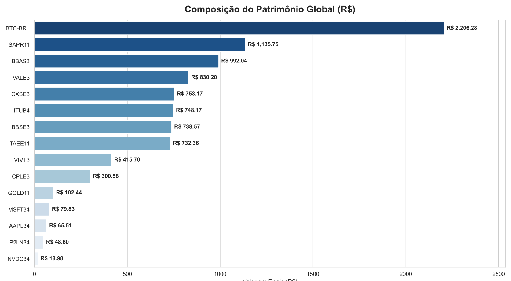
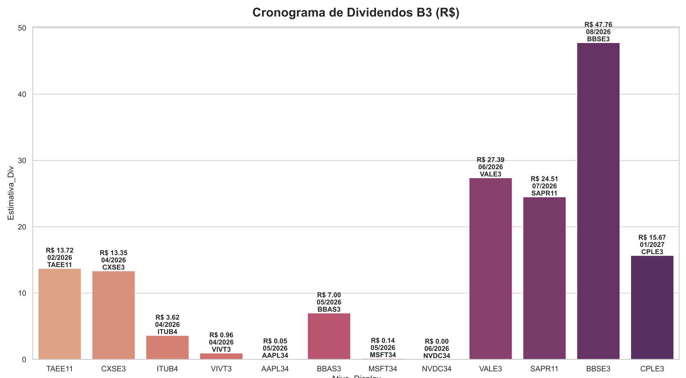
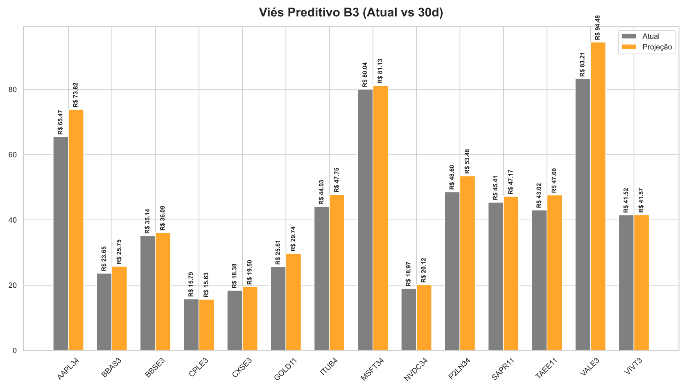

# 📈 Sniper B3: Ecossistema Master Quantitativo & IA (V5.0 - POO)

Um ecossistema avançado de **Engenharia de Dados**, **Inteligência Artificial (Multi-Agent)** e **Automação Quantitativa** construído em Python. O projeto funciona como um motor de *Hedge Fund* particular: automatiza a extração de dados (ETL), o monitoramento tático de ativos da B3 e utiliza modelos preditivos, indicadores técnicos (MACD, Bollinger) e um pipeline de Agentes LLM para embasar o rebalanceamento de carteira e proteger o capital.

Na versão 5.0, o sistema foi integralmente refatorado para o padrão **POO (Programação Orientada a Objetos)** e conteinerizado via **Docker**, garantindo modularidade, blindagem de memória e execução autônoma local durante o horário do pregão.

## 🛠️ Stack Tecnológica

| Categoria | Tecnologias e Frameworks |
| :--- | :--- |
| **Linguagem & Infra** |   |
| **Inteligência Artificial** |    |
| **Mercado & Dados** |   |
| **Interface & DataViz** |    |

## 📐 Arquitetura Modular (Fonte Única de Verdade)
A arquitetura do sistema foi isolada em micro-módulos para garantir escalabilidade e resiliência contra falhas de API:
1. **`dados_mercado.py` (ETL):** Consumo centralizado via API do Google Sheets (`UNFORMATTED_VALUE`) e *YFinance*. Cálculo de Saldo Ajustado e Preço Médio inteligente.
2. **`indicadores.py` (Quantitativo):** Fábrica de cálculos matemáticos vetoriais (RSI, MACD, Bollinger e Regressão Linear).
3. **`agentes_ia.py` (Cérebro & RAG):** - Orquestração via **LangGraph** utilizando um Grafo de Estado para decisões não-lineares.
   - **Mecanismo RAG:** O sistema realiza o *scraping* de notícias em tempo real via `yfinance.news`. Esses dados são injetados no contexto do LLM (**Llama 3.3**), permitindo que a IA interprete se uma queda no preço é uma oportunidade técnica ou um risco fundamentalista (ex: divulgação de balanços ou fatos relevantes).
4. **`agentes_ia.py` (LangGraph):** Motor de IA com LangGraph e Groq (Llama 3.3). Cruza indicadores técnicos com o contexto fundamentalista de notícias recentes.
5. **`relatorios_pdf.py` (DataViz):** Geração headless de relatórios em PDF com gráficos individuais e formatação condicional.
6. **`orquestrador.py` (Motor Async):** Loop assíncrono blindado contra concorrência (Race Conditions), responsável por gerenciar a comunicação com o Telegram e o disparo de relatórios.

---

## ⚙️ A Tríade de Decisão (Módulos do Sistema)

### 1. Radar Sniper (Operacional e Tático)
Um robô que avalia o mercado a cada 10 minutos em busca de exaustão de preço.
* **Memória de PM Histórico:** Se um ativo for totalmente vendido com lucro, o sistema guarda seu PM. Se a ação despencar irracionalmente no futuro, ele emite um alerta de **🔥 RECOMPRA SNIPER**.
* **Trava de Segurança:** O ecossistema repousa automaticamente fora do horário comercial (10h às 18h), otimizando o consumo de APIs e hardware.

### 2. Gestão de Aportes Quantitativos & IA Conselheira
Inteligência de rebalanceamento cruzada com tendência, *Momentum* e LLMs.
* **Filtro Mestre (Faca Caindo):** Bloqueia sumariamente aportes em ativos com **Viés Preditivo Negativo**, protegendo o caixa.
* **Conselho de IA:** Após o motor quantitativo escolher o alvo, a IA gera um veredito final em Markdown aprovando ou recusando a operação com base na distância da meta e análise técnica.

### 3. Dashboard Estratégico Multiparâmetros (PDFs Gerados)
Visão consolidada da saúde do patrimônio separada em Lâminas visuais limpas e individuais, processadas dinamicamente e enviadas para o gestor.

## 🧠 O Diferencial: Inteligência com Contexto (RAG)
Diferente de robôs comuns que olham apenas indicadores, o **Sniper B3** utiliza um pipeline de **Retrieval-Augmented Generation**:
* **Busca Ativa:** Sempre que um ativo entra no radar, o sistema busca as 3 notícias mais recentes e relevantes.
* **Filtragem de Ruído:** O Agente Fundamentalista limpa o "ruído" das notícias e entrega para o Conselheiro apenas o que impacta o *Value Investing*.
* **Veredito Híbrido:** O resultado final é uma síntese que une a frieza dos números (Bollinger/MACD) com a temperatura do mercado (Notícias).

**Visão Global e Exposição**
| Mapa de Alocação de Capital (Treemap) |
| :---: |
|  |

| Composição Patrimonial Global (R$) |
| :---: |
|  |

**Performance e Proventos Futuros**
| Performance Financeira por Ativo (Lucro Real vs PM) |
| :---: |
|  |

| Cronograma de Dividendos B3 (Projeção Anualizada) |
| :---: |
|  |

**Projeções e Acompanhamento de Tendências**
| Viés Preditivo B3 (Preço Atual vs Projeção 30 dias via Regressão Linear) |
| :---: |
|  |

**DRE e Aportes Inteligentes**
| DRE Analítico e Decisão do Algoritmo de Compra |
| :---: |
|  |

---

## 📊 Regras de Negócio Core

| Gatilho / Módulo | Regra / Algoritmo Aplicado | Objetivo Estratégico |
| :--- | :--- | :--- |
| **Cotação Sintética** | `BTC-USD * USDBRL=X` | Garantir monitoramento em Reais via Yahoo Finance independente da instabilidade BRL. |
| **Compra Sniper** | `Preço < (PM * 0.85)` & `RSI <= 25` | Capturar pânico irracional do mercado com margem de segurança de 15%. |
| **Venda Tática** | `RSI >= 75` ou (`Lucro > 5%` & `Viés < -10%`) | Realizar lucro na euforia ou proteger capital em inversão de tendência. |
| **Aporte Seguro** | `Viés > 0` & `Distância Meta < -2.0%` | Garantir que o capital novo só compre ativos descontados em tendência de alta. |
| **Análise Quant (IA)**| `MACD Histograma` + `Bandas de Bollinger` | Otimizar o *timing* de aportes utilizando visão computacional de sobrecompra. |

---

## 🚀 Como Utilizar (Docker Local)

Este ecossistema foi projetado para rodar localmente durante o pregão da bolsa, garantindo atualização em tempo real sem custos de nuvem.

1. Clone o repositório.
2. Certifique-se de que o seu arquivo de credenciais (`ultra-hologram-*.json`) do Google Cloud esteja na pasta principal do projeto.
3. Configure as variáveis de ambiente `GROQ_API_KEY`, `ID_PLANILHA`, `BOT_TOKEN` e `CHAT_ID` no arquivo `config.py`.
4. Inicie o ecossistema via **Docker Compose**:
   ```bash
   docker-compose up -d --build

---

**Desenvolvido por Bruno Felipe de Almeida** *Especialista em BI & Analytics (USP) | Engenheiro de Dados* [](https://www.linkedin.com/in/bruno-felipe-de-almeida/)