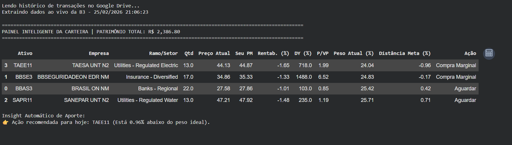

# 📈 Automação e Balanceamento de Carteira B3

Um pipeline de dados (ETL) e dashboard gerencial construído em Python para automatizar o acompanhamento, o rebalanceamento e a análise preditiva de uma carteira de ações na Bolsa de Valores Brasileira (B3).

## 🎯 O Problema

Plataformas de corretoras e planilhas manuais mostram a cotação atual, mas falham em fornecer *insights* acionáveis. O investidor frequentemente perde tempo calculando preço médio na mão, tem dificuldade de projetar recebimentos futuros ou deixa o emocional ditar qual ativo comprar no mês.

## 💡 A Solução

Este projeto utiliza conceitos de Engenharia de Dados, Business Intelligence e Análise Preditiva para criar uma arquitetura autônoma e inteligente:

1. **Extract:** Consome dados transacionais diretamente de um banco de dados em nuvem (Google Sheets) via API, mantendo o histórico de compras como fonte única da verdade.
2. **Transform:** Realiza o agrupamento matemático das posições, calcula o Preço Médio ponderado e cruza com dados em tempo real da B3.
3. **Load/BI & Analytics:** Gera análises profundas sobre a saúde da carteira, indo muito além do saldo atual.

### 🌟 Funcionalidades Principais (Features)

* **Smart Allocation (Rebalanceamento):** Calcula a distância exata de cada ativo em relação à meta de alocação da carteira, indicando matematicamente onde deve ser o aporte do mês para diluir riscos.
* **Alertas Ativos via Telegram (Radar B3):** Motor de regras autônomo (*Screener*) que avalia o Preço Médio e o indicador de Força Relativa (RSI), identificando matematicamente ativos sobrevendidos (desconto tático) ou sobrecomprados (lucro) e disparando alertas diretos no celular.
* **DRE e Performance Global:** Acompanhamento do resultado não-realizado (lucro/prejuízo) de forma consolidada, permitindo a visão clara do retorno sobre o capital investido.
* **Inteligência Preditiva (Viés de 30 Dias):** Modelagem que analisa a tendência de preço dos ativos para os próximos 30 dias, auxiliando no *timing* de compra (identificando possíveis correções ou altas).
* **Agenda de Dividendos (Fluxo de Caixa):** Mapeamento e estimativa dos próximos proventos a serem recebidos, organizados em uma linha do tempo para facilitar a previsibilidade de renda passiva.

## 📊 Visualização dos Dados e Resultados

Abaixo estão os resultados das análises e as notificações ativas geradas pelo ecossistema:

**1. Radar de Oportunidades - Notificação via Telegram**
*O sistema monitora o mercado e envia alertas táticos baseados em RSI e Preço Médio diretamente para o celular.*

**2. Smart Allocation (Indicação de Aporte do Mês)**
*Cálculo matemático que indica o ativo ideal para compra, visando manter o balanceamento e diluir o risco da carteira.*

**3. Performance Global e DRE da Carteira**

**4. Composição do patrimônio e Lucro / Prejuizo por Empresa**

**5. Estimativa de recebimentos e Viés de Movimento**

---

## ⚙️ Regras de Negócio e Lógica Analítica

O projeto segue critérios matemáticos rigorosos para evitar o viés emocional nas decisões:

| Módulo | Regra Aplicada | Objetivo |
| :--- | :--- | :--- |
| **Rebalanceamento** | `Peso Atual < (Meta - 2%)` | Classifica o ativo como **Forte Compra** para reenquadramento tático. |
| **Radar B3 (Compra)** | `Preço Atual < PM` E `RSI <= 35` | Identifica ativos com desconto real e exaustão de venda (oportunidade). |
| **Radar B3 (Venda)** | `Preço Atual > (PM * 1.10)` E `RSI >= 70` | Sugere realização de lucro parcial em ativos sobrecomprados. |
| **Predição 30d** | `Regressão Linear (Numpy)` | Projeta a tendência de preço baseada no histórico dos últimos 180 dias. |

---

## 🛠️ Tecnologias Utilizadas

* **Python**
* **Pandas:** Manipulação de DataFrames e cálculos de agregação financeira.
* **YFinance:** Extração de cotações e indicadores em tempo real.
* **Gspread / Google Auth:** Integração segura com o banco de dados em nuvem.
* **Requests:** Comunicação via API com o Bot do Telegram.
* **Matplotlib / Seaborn:** Geração de visualizações analíticas e dashboards.

## 📂 Arquitetura do Projeto

* `/src`: Scripts Python contendo o motor de análise, ETL e integrações de API.
* `/docs`: Documentação técnica e Dicionário de Dados.
* `/img`: Capturas de tela dos resultados e notificações.

## 🚀 Como utilizar

1. Clone o repositório.
2. Certifique-se de possuir as credenciais do Google Cloud (`.json`) na pasta `src`.
3. Configure seu `TOKEN` e `CHAT_ID` do Telegram no script de radar.
4. Execute o motor analítico via terminal ou agendador de tarefas para receber os alertas.

---
