# 📈 Sniper B3: Ecossistema Master Quantitativo & IA (V4.0)

Um ecossistema avançado de **Engenharia de Dados**, **Inteligência Artificial (Multi-Agent)** e **Automação Quantitativa** construído em Python. O projeto funciona como um motor de *Hedge Fund* particular: automatiza a extração de dados (ETL), o monitoramento tático de ativos (B3 e Criptomoedas) e utiliza modelos preditivos, indicadores técnicos (MACD, Bollinger) e um pipeline RAG com LLMs para embasar o rebalanceamento de carteira e proteger o capital.

## 🎯 O Problema
Investidores enfrentam dificuldades em manter a disciplina emocional em mercados voláteis, muitas vezes falhando em identificar o *timing* técnico ideal para aportes, tentando "pegar facas caindo" ou ignorando o contexto macroeconômico. Além disso, gerenciar planilhas de diferentes classes de ativos gera ruído. Este projeto resolve essa dor unindo **algoritmos matemáticos frios** com o **contexto fundamentalista de Agentes de IA**.

## 💡 A Solução (Arquitetura Master AI)
Na versão 4.0, o sistema evoluiu para um **Ecossistema Master Unificado** com estratégia **Core-Satellite** e tomada de decisão impulsionada por IA. Utilizando conceitos sólidos de **ETL**, **Containerização** e **Grafos de IA**, a arquitetura opera com *Single Source of Truth* (Fonte Única da Verdade):

1. **Extract (Extração Blindada e Sequencial):** Consumo centralizado via API do Google Sheets (`UNFORMATTED_VALUE`) e *YFinance* (histórico de 180 dias). O pipeline possui travas anti-concorrência (`threads=False`) no cache do SQLite e bloqueio de execução fora do horário comercial da B3, otimizando o consumo de APIs.
2. **Transform (Cálculos e Cotação Sintética):** Processamento de Saldo Ajustado, cálculo de Preço Médio inteligente e modelagem estatística. O sistema cria uma **Cotação Sintética** para o Bitcoin (`BTC-USD * USDBRL=X`) como *failover* para quedas de pareamento BRL nas APIs.
3. **AI Pipeline (RAG & Agentes):** Integração com LangGraph e Groq (Llama 3). O sistema coleta notícias em tempo real e as cruza com os dados quantitativos para gerar um *Dossiê de Value Investing*.
4. **Load/Analytics (A Tríade Sniper):** O pipeline alimenta três módulos de decisão simultâneos e envia dashboards executivos *multi-page* em PDF e alertas táticos via Telegram.

---

## ⚙️ A Tríade de Decisão (Módulos do Sistema)

### 1. Radar Sniper (Operacional e Tático)
Um robô que avalia o mercado em busca de exaustão de preço.
* **Memória de PM Histórico:** Se um ativo for totalmente vendido com lucro, o sistema guarda seu PM. Se a ação despencar irracionalmente no futuro, ele emite um alerta de **🔥 RECOMPRA SNIPER**.
* **Trava de Segurança (Cripto):** O ecossistema silencia o Bitcoin fora do horário comercial, deixando a alta volatilidade a cargo da corretora, focando puramente na visão analítica diária.

### 2. Dashboard Estratégico (Visão Executiva)
Visão consolidada da saúde do patrimônio separada em Lâminas visuais complexas.
* **Página 1 (Mapa Global & B3):** Exibe o *Treemap* (Mapa de Alocação de Capital), Cronograma de Dividendos futuros projetados pela média dos últimos 12 meses e Viés Preditivo de curto prazo.
* **Página 2 (Satélite Cripto):** Focada em *Trend Following*. Isola ativos alternativos, cruzando o preço de fechamento com uma Média Móvel (SMA30) para identificar graficamente zonas de suporte e resistência.

### 3. Gestão de Aportes Quantitativos & IA Conselheira
Inteligência de rebalanceamento cruzada com tendência, *Momentum* e LLMs.
* **Filtro Mestre (Faca Caindo):** Bloqueia sumariamente aportes em ativos com **Viés Preditivo Negativo**, protegendo o caixa.
* **Caçador de Assimetrias:** Atua como um *Momentum Trader*, priorizando matematicamente o ativo mais descontado em relação à meta, mas com maior projeção de alta.
* **Conselho de IA:** Após o motor quantitativo escolher o alvo, um Agente de IA analisa RSI, Bandas de Bollinger, MACD e as últimas notícias da empresa, gerando um veredito final formatado em Markdown aprovando ou recusando a operação.

---

## 📊 Regras de Negócio e Indicadores

| Gatilho / Módulo | Regra / Algoritmo Aplicado | Objetivo Estratégico |
| :--- | :--- | :--- |
| **Cotação Sintética** | `BTC-USD * USDBRL=X` | Garantir monitoramento em Reais independente da instabilidade da API BRL. |
| **Compra Sniper** | `Preço < (PM * 0.85)` & `RSI <= 25` | Capturar pânico irracional do mercado com margem de segurança de 15%. |
| **Venda Tática** | `RSI >= 75` ou (`Lucro > 5%` & `Viés < -10%`) | Realizar lucro na euforia ou proteger capital em inversão de tendência. |
| **Aporte Seguro** | `Viés > 0` & `Distância Meta < -2.0%` | Garantir que o capital novo só compre ativos descontados em tendência de alta. |
| **Análise Quant (IA)**| `MACD Histograma` + `Bandas de Bollinger` | Identificar reversões de tendência precisas antes do aporte de capital. |
| **RAG Fundamentalista**| `yfinance.news` + `LangGraph` + `Llama 3` | Injetar contexto de notícias do dia na tomada de decisão matemática. |

---

## 🖥️ Evidências e Relatórios Gerados

### 1. Operacional e Execução em Background
O pipeline é executado em background de forma contínua via Docker.
> 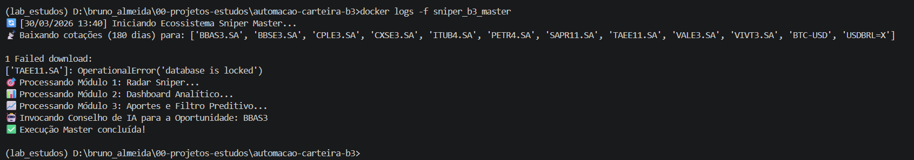

### 2. Notificações e IA (Telegram)

**Sinais de Mercado (Radar Sniper)**
| Compra e Recompra | Realização de Lucro | Zona Neutra (Monitoramento) |
| :---: | :---: | :---: |
| 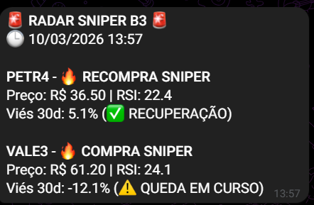 | 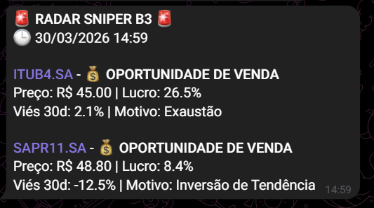 | 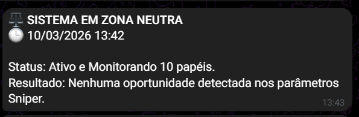 |

**Relatórios e Dossiê de Inteligência Artificial**
| Posição Global e Viés | Insight de Aporte (Quantitativo) | Dossiê Fundamentalista (IA) |
| :---: | :---: | :---: |
| 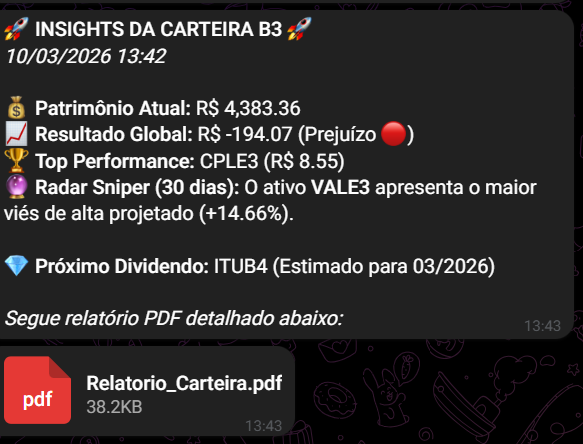 | 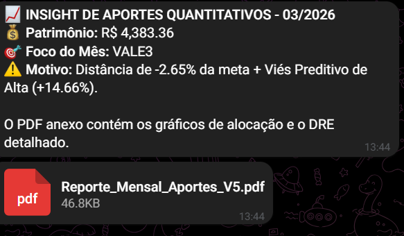 | 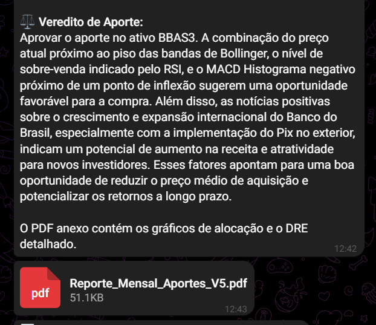 |

### 3. Dashboard Analítico Multiparâmetros (PDF)

**Visão Global e Performance B3**
| Mapa de Alocação de Capital (Treemap) | Composição Patrimonial e Resultados |
| :---: | :---: |
| 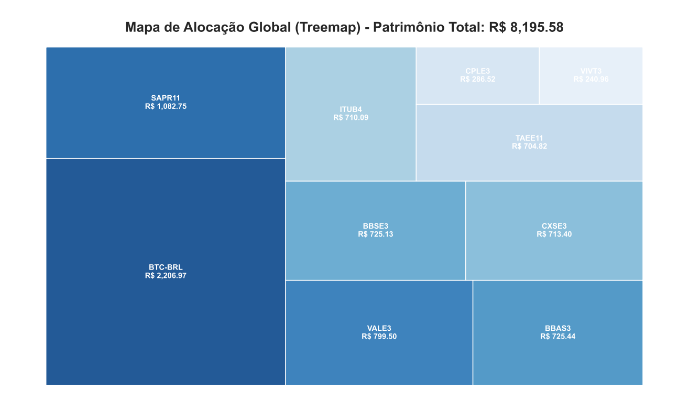 | 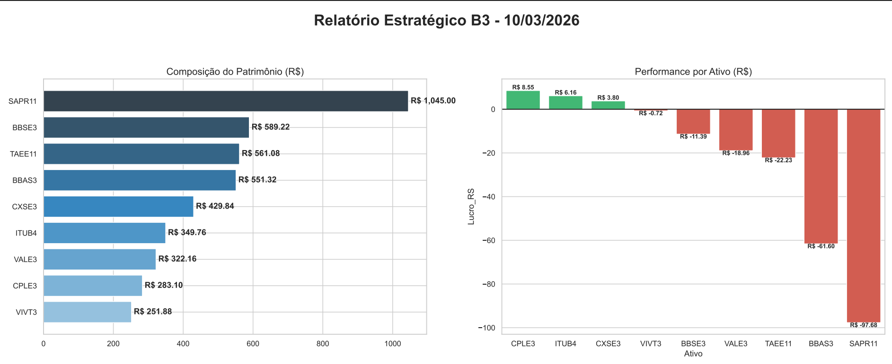 |

**Projeções e Acompanhamento de Tendências**
| Dividendos Projetados e Viés B3 (30d) |
| :---: |
| 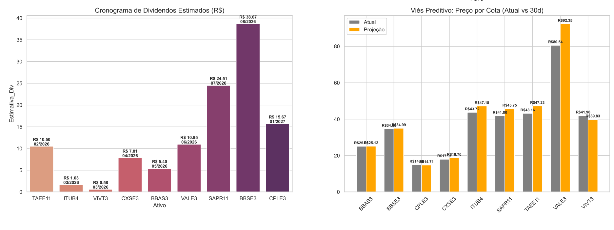 |

**Visão de Ativos Alternativos (Criptomoedas)**
| Trend Following Cripto (SMA30) | KPIs e DRE Cripto |
| :---: | :---: |
| 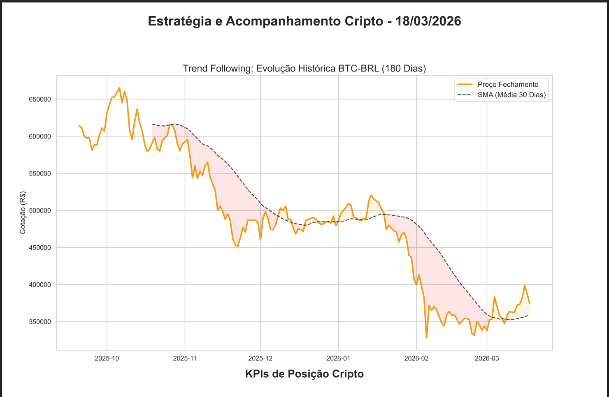 | 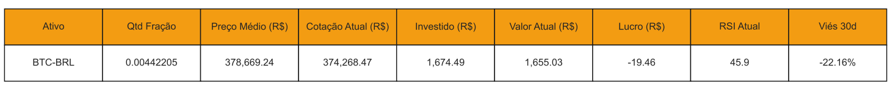 |

### 4. Motor de Aportes Mensais (DRE Quantitativo)
| Comparativo: Posição Atual vs Meta de Alocação |
| :---: |
| 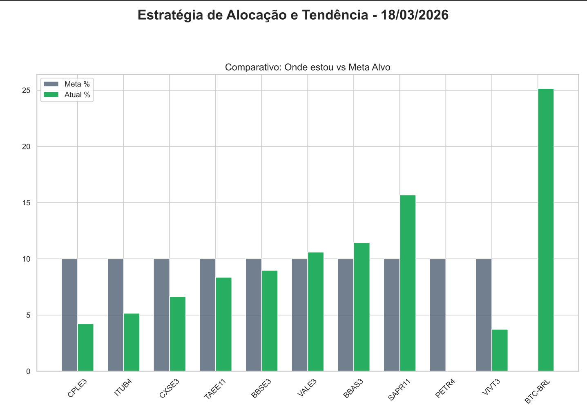 |

| Distância da Meta | DRE Analítico e Decisão do Algoritmo |
| :---: | :---: |
| 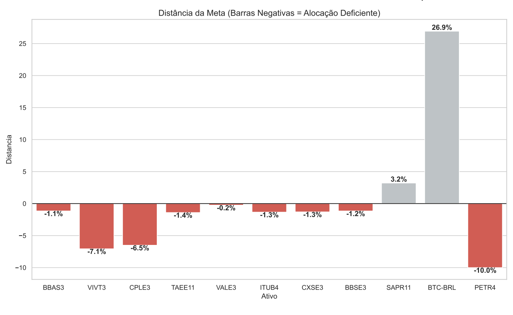 | 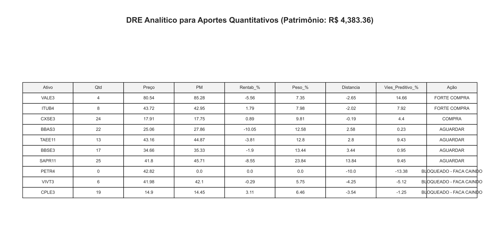 |

---

## 🛠 Tecnologias Utilizadas


* **Python / Pandas / Numpy:** Motor central para ETL, junções sintéticas e cálculos matemáticos vetoriais.
* **LangGraph & Groq (Llama 3):** Orquestração de Agentes de IA com grafos de estado para emissão de pareceres de investimento.
* **YFinance:** Consumo de histórico de preços, *cross-currency* e *news scraping* para RAG.
* **Matplotlib / Seaborn / Squarify:** Geração de relatórios PDF com visualização de dados avançada (Treemaps, fill_between).
* **Docker:** Containerização completa da aplicação com fuso horário ajustado (`America/Sao_Paulo`) e orquestração autônoma via *Shell Loop*.

---

## 🚀 Como Utilizar

1. Clone o repositório.
2. Configure as **Variáveis de Ambiente / Credenciais** no seu sistema (salvando o arquivo JSON de credenciais do Google Cloud na raiz do projeto e configurando `GROQ_API_KEY`, `ID_PLANILHA`, `BOT_TOKEN` e `CHAT_ID` no código principal).
3. Mantenha os seus ativos em uma planilha única do Google Sheets.
4. Para automação *hands-off*, construa a imagem e inicie o ecossistema via **Docker**:
   ```bash
   docker build -t sniper-bot .
   docker run -d --name meu-sniper-bot --restart unless-stopped sniper-bot